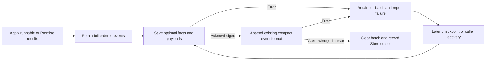

# Issue 21: Acknowledged Worker Persistence

This change addresses [Runic issue #21](https://github.com/zblanco/runic/issues/21).
The failure is in the managed runtime's acknowledgement handling, not the pure
workflow graph or the execution protocols.

## Architecture and failure mechanism

Runic separates preparation, execution, and application. `Invokable` executions
produce events; `Workflow.apply_runnable/2` folds them into the labelled multigraph
and, when enabled, buffers events in reverse order. The Worker owns execution
processes, restores chronological event order, and persists via `Runner.Store`.
Schedulers can deliver individual runnables or Promise batches; both must obey
the same persistence boundary. Full-log Stores remain a supported alternative to
incremental event streams. Snapshots accelerate recovery; they are not required
for checkpoint correctness.

Previously, explicit checkpoint and final save ignored Store error returns and
cleared `uncommitted_events`. The explicit handler then replied `:ok`. The cursor
also advanced when events were generated rather than when append acknowledged
them. Optional fact/payload writes ignored failures before event values were
removed, permitting a committed reference to a value that had not been saved.
Finally, the idle transition discarded the locally updated persistence state
when leaving its `if` expression, retaining already saved events for another append.

## Persistence boundary

Event collection no longer writes values or advances a cursor. It retains full
values until a persistence attempt successfully saves every required value and
appends the entire batch. The compact journal remains identical: `FactProduced`
values are removed for Stores exposing fact storage, while Stores without that
capability keep inline values. Successful value writes may be repeated after a
later failure, so adapters must support idempotent key/value saves. Initial build
events use the same acknowledgement/error handling before any work is dispatched.

Both checkpoint and final save return an internal outcome with the updated or
retained Worker state. Explicit checkpoint replies with that outcome. Automatic
checkpoints retain state and surface errors through logs, hooks, and telemetry.
The idle transition now returns its actual persistence state, avoiding duplicate
appends after successful completion. Final stop only terminates after successful
persistence, unless the caller explicitly selects `persist: false`.

## Public compatibility and observation

- Successful checkpoint/stop calls still return `:ok`.
- Failed writes return `{:error, {:persistence_failed, reason}}`; initial build
  failure returns the same structured error from `start_workflow/4`.
- Failed stop-with-persist leaves the Worker alive, including its pending data.
- `on_complete` remains computation completion with its existing two-argument
  function and MFA forms. It still runs if final persistence fails. This change
  introduces no mode or callback that promises durable completion.
- `persistence_status/2` reports `:saved`, `:pending`, or the last persistence
  error, plus the acknowledged cursor and pending event count. It is a synchronous
  query; hooks must notify a separate coordinator rather than call their own Worker.
- `hooks: [on_persistence_error: fn operation, reason, state -> ... end]` observes
  automatic and explicit returned failures without replacing completion hooks.
- Workflow `:stop` telemetry includes persistence outcome. Store `:stop` telemetry
  includes operation and callback result, including returned errors; `:exception`
  retains telemetry's raised-error/exit meaning.
- Store callbacks and persisted event/snapshot schemas are unchanged. Value writes
  now occur at persistence boundaries, rather than during result application.

`:saved` is scoped to the workflow state acknowledged so far; active tasks can
produce more work. Cursor zero means no append has been acknowledged by this
Worker, including immediately after resume. A Store cursor is authoritative and
need not equal a local event count. Snapshot Stores have no cursor. Store
acknowledgement carries the adapter's durability guarantees; ETS is VM-local.

## Retry, memory, and remote-write limits

Each persistence attempt is finite; there is no timer, backoff loop, or automatic
dispatch pause. Cycle checkpoints follow the configured cadence, and idle retry
is caller-driven. Applications must bound admitted batches and memory growth,
observe failures/counts, and implement bounded retry/backoff or rebuild from their
own recovery records. Retention protects a live Worker's buffer, not a buffer lost
when the Worker or VM dies. These choices preserve Runic's topology-independent
core and the existing best-effort execution model.

Adapters should append an ordered batch atomically, returning success for the
entire batch or an error without accepting events. An ambiguous remote outcome
requires adapter deduplication or a documented limitation. Retaining and resending
alone is not exactly-once persistence. Separate value writes can leave orphaned
values after an append failure; their retention belongs to the adapter. Raised
exceptions/exits are still OTP failures; adapters should normalize operational
errors to their declared return contract.

Pause/admission controls, scoped Store contexts, distributed ownership, snapshot
policies, and external-effect exactly-once semantics are outside this fix.

## Validation

The barrier-based regression first failed against the unmodified Worker because
checkpoint returned `:ok` after `{:error, :storage_unavailable}`. Tests use
supervised Agents/Runners, message barriers, and process monitors without sleeps.
Coverage includes repeated append failure, the Store's non-count cursor,
successful retry, legacy checkpoint and save fallback, stop retry/discard,
structured build failure, partial value writes, original values on append retry,
nil values, callbacks/status/telemetry, successful idle buffer clearing, inline
execution, sequential and parallel Promises, and native map/reduce coordination
with durable runnable events, including a Workflow evaluated before Worker startup.
The existing parallel Promise telemetry test now selects its expected node set,
pairs start/stop by Promise ID, and detaches its handler on exit, avoiding
cross-test event consumption in async runs.
Recovery checks compare actual resumed productions
for Step workflows and resolve persisted fact references and payload bytes.
The Map/Reduce test verifies runtime event replay against the authored topology.

An additional isolated probe compared full Map/Reduce reconstruction using the
unmodified `origin/main` Worker and this fix, both with the default ETS Store and
successful writes. Both produced `[2, 4, 6, 12]` before stop and `[]` after full
`Runner.resume/3`. Runtime events replay correctly against the original topology;
the separate build-log reconstruction limitation is not repaired here and must
not be presented as validated full Map/Reduce resume support.

See `test/runner/persistence_failure_test.exs` for the executable acceptance
surface and `guides/durable-execution.md` for application and adapter usage.

Final checks on the implementation based on `origin/main` at `ddcde3a`:

- `mix test test/runner/persistence_failure_test.exs`: 26 tests, zero failures.
- `mix test --seed 905355`: 55 doctests, 1,449 tests, zero failures, 13 skipped.
- `mix compile --warnings-as-errors`: passed.
- `mix format --check-formatted` and `git diff --check`: passed.
