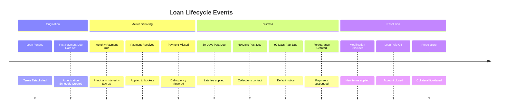

# Runic Use Case: Loan Servicing Domain

A domain-driven exploration of how Runic can model and automate loan servicing workflows.

## Domain Overview

**Loan servicing** is the process of managing a loan from origination through payoff. It involves collecting payments, managing escrow, applying business rules for late fees, handling modifications, and ensuring regulatory compliance.

This domain is ideal for Runic because:
- **Dynamic rule composition**: Loan products vary significantly (fixed-rate, ARM, balloon, interest-only)
- **Event-driven state transitions**: Loans move through lifecycle states based on events
- **Complex conditional logic**: Delinquency, forbearance, modification rules differ by product and investor
- **Runtime configurability**: New loan products and servicing rules emerge frequently

---

## Domain Stakeholders & Roles

### Primary Actors

| Role | Responsibilities |
|------|------------------|
| **Borrower** | Makes payments, requests modifications, receives statements |
| **Servicer** | Collects payments, manages escrow, enforces terms |
| **Investor** | Owns the loan, defines servicing requirements |
| **Regulator** | Defines compliance rules (RESPA, TILA, CFPB) |

### Supporting Actors

| Role | Responsibilities |
|------|------------------|
| **Credit Bureau** | Receives payment reporting data |
| **Escrow Agent** | Manages tax/insurance disbursements |
| **Collections** | Handles delinquent accounts |
| **Loss Mitigation** | Processes loan modifications, forbearance |

---

## Temporal Events in Loan Servicing



---

## Domain Model: Core Aggregates

### Loan Aggregate (Root)

```elixir
defmodule LoanServicing.Loan do
  @moduledoc """
  The Loan aggregate root - the central entity in loan servicing.
  All servicing operations flow through the loan context.
  """
  
  defstruct [
    :loan_id,
    :product_type,           # :fixed_rate, :arm, :balloon, :interest_only
    :original_principal,
    :current_principal,
    :interest_rate,
    :term_months,
    :origination_date,
    :maturity_date,
    :payment_day,            # Day of month payment is due
    :status,                 # :current, :delinquent, :default, :forbearance, :paid_off
    :escrow_required?,
    :investor_id,
    :servicing_rules         # Reference to applicable rule set
  ]
end
```

### Payment Event

```elixir
defmodule LoanServicing.Payment do
  @moduledoc """
  A payment event - the primary input to servicing workflows.
  """
  
  defstruct [
    :payment_id,
    :loan_id,
    :amount,
    :received_date,
    :effective_date,
    :source,                 # :ach, :check, :wire, :online
    :payment_type            # :regular, :extra_principal, :escrow_only, :payoff
  ]
end
```

### Servicing State

```elixir
defmodule LoanServicing.ServicingState do
  @moduledoc """
  The accumulated state of a loan's servicing - maintained over time.
  """
  
  defstruct [
    :loan_id,
    :next_due_date,
    :days_past_due,
    :unpaid_principal,
    :unpaid_interest,
    :unpaid_escrow,
    :unpaid_fees,
    :escrow_balance,
    :last_payment_date,
    :payment_history,         # List of applied payments
    :delinquency_history,     # Tracking for reporting
    :modification_history
  ]
end
```

---

## Loan Product Variations & Invariants

### Fixed-Rate Mortgage

```elixir
defmodule LoanServicing.Products.FixedRate do
  @moduledoc """
  Fixed-rate mortgage - interest rate never changes.
  
  Invariants:
  - Interest rate is constant for life of loan
  - Payment amount is constant (P&I portion)
  - Standard amortization schedule
  """
  
  @behaviour LoanServicing.Product
  
  def calculate_payment(%{principal: p, rate: r, term: t}) do
    monthly_rate = r / 12
    factor = :math.pow(1 + monthly_rate, t)
    p * (monthly_rate * factor) / (factor - 1)
  end
  
  def interest_for_period(%{principal: p, rate: r}, _period) do
    p * (r / 12)
  end
end
```

### Adjustable-Rate Mortgage (ARM)

```elixir
defmodule LoanServicing.Products.ARM do
  @moduledoc """
  Adjustable-rate mortgage - rate changes based on index + margin.
  
  Invariants:
  - Rate = Index + Margin (subject to caps)
  - Initial fixed period before first adjustment
  - Periodic and lifetime caps limit rate changes
  - Payment recalculated at each adjustment
  """
  
  @behaviour LoanServicing.Product
  
  defstruct [
    :index,              # :sofr, :prime, :libor
    :margin,             # Added to index (e.g., 2.75%)
    :initial_rate,
    :initial_period,     # Months before first adjustment
    :adjustment_period,  # Months between adjustments
    :periodic_cap,       # Max rate change per adjustment
    :lifetime_cap,       # Max rate over life
    :floor               # Minimum rate
  ]
  
  def calculate_rate(%__MODULE__{} = arm, current_index, current_rate) do
    new_rate = current_index + arm.margin
    
    # Apply periodic cap
    capped = 
      cond do
        new_rate > current_rate + arm.periodic_cap -> 
          current_rate + arm.periodic_cap
        new_rate < current_rate - arm.periodic_cap -> 
          current_rate - arm.periodic_cap
        true -> 
          new_rate
      end
    
    # Apply lifetime cap and floor
    capped
    |> min(arm.initial_rate + arm.lifetime_cap)
    |> max(arm.floor)
  end
end
```

### Balloon Mortgage

```elixir
defmodule LoanServicing.Products.Balloon do
  @moduledoc """
  Balloon mortgage - large final payment due at maturity.
  
  Invariants:
  - Regular payments based on longer amortization
  - Remaining balance due as "balloon" at maturity
  - Must track balloon due date distinctly
  """
  
  @behaviour LoanServicing.Product
  
  defstruct [
    :amortization_term,    # e.g., 360 months (30 years)
    :balloon_term,         # e.g., 84 months (7 years)
    :balloon_amount        # Calculated remaining balance
  ]
end
```

---

## Modeling with Runic

### Core Workflow: Payment Application

The payment waterfall is the most common servicing operation. Payments flow through a hierarchy of buckets:

```elixir
defmodule LoanServicing.Workflows.PaymentApplication do
  @moduledoc """
  Payment application workflow - applies incoming payment to loan buckets.
  
  Standard waterfall:
  1. Fees (late fees, NSF fees)
  2. Escrow shortage
  3. Interest
  4. Principal
  5. Escrow current
  6. Suspense (if partial)
  """
  
  require Runic
  alias Runic.Workflow
  
  def build_payment_workflow do
    Runic.workflow(
      name: "payment_application",
      steps: [
        # Step 1: Validate payment
        {Runic.step(&validate_payment/1, name: :validate_payment),
         [
           # Step 2: Calculate allocations based on waterfall
           {Runic.step(&calculate_waterfall/1, name: :calculate_waterfall),
            [
              # Step 3: Apply to individual buckets (parallel)
              Runic.step(&apply_to_fees/1, name: :apply_fees),
              Runic.step(&apply_to_interest/1, name: :apply_interest),
              Runic.step(&apply_to_principal/1, name: :apply_principal),
              Runic.step(&apply_to_escrow/1, name: :apply_escrow)
            ]}
         ]}
      ]
    )
  end
  
  defp validate_payment(%{payment: payment, loan: loan}) do
    cond do
      payment.amount <= 0 ->
        {:error, :invalid_amount}
      payment.loan_id != loan.loan_id ->
        {:error, :loan_mismatch}
      loan.status == :paid_off ->
        {:error, :loan_closed}
      true ->
        {:ok, %{payment: payment, loan: loan, validated: true}}
    end
  end
  
  defp calculate_waterfall({:ok, %{payment: payment, loan: loan} = context}) do
    state = get_servicing_state(loan.loan_id)
    remaining = payment.amount
    
    allocations = %{
      to_fees: min(remaining, state.unpaid_fees),
      to_interest: 0,
      to_principal: 0,
      to_escrow: 0,
      to_suspense: 0
    }
    
    remaining = remaining - allocations.to_fees
    
    allocations = %{allocations | to_interest: min(remaining, state.unpaid_interest)}
    remaining = remaining - allocations.to_interest
    
    allocations = %{allocations | to_principal: min(remaining, state.unpaid_principal)}
    remaining = remaining - allocations.to_principal
    
    allocations = %{allocations | to_escrow: min(remaining, state.unpaid_escrow)}
    remaining = remaining - allocations.to_escrow
    
    # Extra goes to principal by default
    allocations = %{allocations | to_principal: allocations.to_principal + remaining}
    
    Map.put(context, :allocations, allocations)
  end
  
  defp calculate_waterfall({:error, _} = error), do: error
  
  defp apply_to_fees(%{allocations: %{to_fees: amount}} = ctx) when amount > 0 do
    # Apply fee payment logic
    Map.put(ctx, :fees_applied, amount)
  end
  defp apply_to_fees(ctx), do: Map.put(ctx, :fees_applied, 0)
  
  defp apply_to_interest(%{allocations: %{to_interest: amount}} = ctx) when amount > 0 do
    Map.put(ctx, :interest_applied, amount)
  end
  defp apply_to_interest(ctx), do: Map.put(ctx, :interest_applied, 0)
  
  defp apply_to_principal(%{allocations: %{to_principal: amount}} = ctx) when amount > 0 do
    Map.put(ctx, :principal_applied, amount)
  end
  defp apply_to_principal(ctx), do: Map.put(ctx, :principal_applied, 0)
  
  defp apply_to_escrow(%{allocations: %{to_escrow: amount}} = ctx) when amount > 0 do
    Map.put(ctx, :escrow_applied, amount)
  end
  defp apply_to_escrow(ctx), do: Map.put(ctx, :escrow_applied, 0)
  
  defp get_servicing_state(_loan_id) do
    # Fetch from database
    %LoanServicing.ServicingState{
      unpaid_fees: Decimal.new("0.00"),
      unpaid_interest: Decimal.new("500.00"),
      unpaid_principal: Decimal.new("1000.00"),
      unpaid_escrow: Decimal.new("250.00")
    }
  end
end
```

### Rules-Based Delinquency Handling

Late fees and delinquency status changes are perfect for Runic rules:

```elixir
defmodule LoanServicing.Workflows.Delinquency do
  @moduledoc """
  Delinquency rules engine - applies business rules for late accounts.
  Rules vary by investor, product type, and regulatory jurisdiction.
  """
  
  require Runic
  alias Runic.Workflow
  
  def build_delinquency_rules(investor_config) do
    grace_period = investor_config[:grace_period_days] || 15
    late_fee_pct = investor_config[:late_fee_percent] || 0.05
    late_fee_cap = investor_config[:late_fee_cap] || Decimal.new("50.00")
    
    Runic.workflow(
      name: "delinquency_rules_#{investor_config[:investor_id]}",
      rules: [
        # Rule 1: Apply late fee after grace period
        Runic.rule(
          fn %{days_past_due: dpd, payment_amount: pmt, late_fee_assessed?: false} 
             when dpd > ^grace_period ->
            fee = min(pmt * ^late_fee_pct, ^late_fee_cap)
            {:assess_late_fee, fee}
          end,
          name: :late_fee_rule
        ),
        
        # Rule 2: Transition to 30-day delinquency
        Runic.rule(
          fn %{days_past_due: dpd, status: :current} when dpd >= 30 ->
            {:transition_status, :delinquent_30}
          end,
          name: :delinquent_30_rule
        ),
        
        # Rule 3: Transition to 60-day delinquency
        Runic.rule(
          fn %{days_past_due: dpd, status: :delinquent_30} when dpd >= 60 ->
            {:transition_status, :delinquent_60}
          end,
          name: :delinquent_60_rule
        ),
        
        # Rule 4: Transition to 90-day delinquency (default)
        Runic.rule(
          fn %{days_past_due: dpd, status: :delinquent_60} when dpd >= 90 ->
            {:transition_status, :default}
          end,
          name: :default_rule
        ),
        
        # Rule 5: Cure - return to current status
        Runic.rule(
          fn %{days_past_due: 0, status: status} 
             when status in [:delinquent_30, :delinquent_60, :default] ->
            {:transition_status, :current}
          end,
          name: :cure_rule
        )
      ]
    )
  end
end
```

### State Machine: Loan Lifecycle

Loans transition through well-defined states. Runic's StateMachine models this:

```elixir
defmodule LoanServicing.Workflows.LoanLifecycle do
  @moduledoc """
  Loan lifecycle state machine - tracks the overall state of a loan.
  """
  
  require Runic
  
  def build_lifecycle_state_machine do
    Runic.state_machine(
      name: :loan_lifecycle,
      init: :active,
      reducer: fn event, state ->
        transition(state, event)
      end
    )
  end
  
  defp transition(:active, {:payment_missed, days_past_due}) when days_past_due >= 30 do
    :delinquent
  end
  
  defp transition(:delinquent, {:payment_received, amount}) when amount > 0 do
    # Check if fully cured
    :active
  end
  
  defp transition(:delinquent, {:days_past_due, dpd}) when dpd >= 90 do
    :default
  end
  
  defp transition(:default, :foreclosure_initiated) do
    :foreclosure
  end
  
  defp transition(:active, :forbearance_granted) do
    :forbearance
  end
  
  defp transition(:forbearance, :forbearance_expired) do
    :active
  end
  
  defp transition(:forbearance, :modification_approved) do
    :modification
  end
  
  defp transition(:modification, :modification_complete) do
    :active
  end
  
  defp transition(_state, :payoff_received) do
    :paid_off
  end
  
  defp transition(state, _event), do: state
end
```

---

## Dynamic Schedule Generation

One of Runic's strengths is **building workflows at runtime** based on loan terms:

```elixir
defmodule LoanServicing.Workflows.ScheduleBuilder do
  @moduledoc """
  Dynamically builds amortization and servicing schedules based on loan terms.
  
  This demonstrates Runic's power for runtime workflow composition - 
  each loan product type generates different calculation steps.
  """
  
  require Runic
  alias Runic.Workflow
  
  @doc """
  Builds a schedule generation workflow customized to the loan's product type.
  """
  def build_schedule_workflow(%{product_type: :fixed_rate} = loan) do
    Runic.workflow(
      name: "schedule_#{loan.loan_id}",
      steps: [
        {Runic.step(&calculate_fixed_payment/1, name: :calc_payment),
         [
           Runic.step(&generate_amortization_schedule/1, name: :gen_schedule),
           Runic.step(&calculate_escrow_analysis/1, name: :escrow_analysis)
         ]}
      ]
    )
  end
  
  def build_schedule_workflow(%{product_type: :arm} = loan) do
    arm_config = loan.arm_config
    
    # ARM loans need rate adjustment steps inserted at adjustment dates
    adjustment_steps = build_rate_adjustment_steps(arm_config)
    
    Runic.workflow(
      name: "schedule_#{loan.loan_id}",
      steps: [
        {Runic.step(&calculate_initial_arm_payment/1, name: :calc_initial),
         [
           # Generate initial schedule
           {Runic.step(&generate_arm_schedule/1, name: :gen_schedule),
            adjustment_steps ++
            [Runic.step(&calculate_escrow_analysis/1, name: :escrow_analysis)]}
         ]}
      ]
    )
  end
  
  def build_schedule_workflow(%{product_type: :balloon} = loan) do
    balloon_config = loan.balloon_config
    
    Runic.workflow(
      name: "schedule_#{loan.loan_id}",
      steps: [
        {Runic.step(&calculate_balloon_payment/1, name: :calc_payment),
         [
           Runic.step(
             fn ctx -> generate_balloon_schedule(ctx, ^balloon_config) end,
             name: :gen_schedule
           ),
           Runic.step(&calculate_balloon_amount/1, name: :calc_balloon)
         ]}
      ]
    )
  end
  
  def build_schedule_workflow(%{product_type: :interest_only} = loan) do
    io_period = loan.interest_only_period
    
    Runic.workflow(
      name: "schedule_#{loan.loan_id}",
      steps: [
        # Two-phase calculation
        {Runic.step(&calculate_io_payment/1, name: :calc_io_payment),
         [
           Runic.step(
             fn ctx -> generate_io_schedule(ctx, ^io_period) end, 
             name: :gen_io_schedule
           )
         ]},
        {Runic.step(&calculate_amortizing_payment/1, name: :calc_amort_payment),
         [
           Runic.step(&generate_amortization_schedule/1, name: :gen_amort_schedule)
         ]}
      ]
    )
  end
  
  # Build rate adjustment rules dynamically based on ARM terms
  defp build_rate_adjustment_steps(%{adjustment_period: period, initial_period: initial}) do
    # Calculate adjustment dates and create steps for each
    adjustment_months = 
      Stream.iterate(initial, &(&1 + period))
      |> Enum.take(10)  # Cap at 10 adjustments for example
    
    Enum.map(adjustment_months, fn month ->
      Runic.rule(
        fn %{current_month: m} = ctx when m == ^month ->
          recalculate_arm_payment(ctx)
        end,
        name: :"rate_adjustment_month_#{month}"
      )
    end)
  end
  
  # Implementation stubs
  defp calculate_fixed_payment(ctx), do: ctx
  defp calculate_initial_arm_payment(ctx), do: ctx
  defp calculate_balloon_payment(ctx), do: ctx
  defp calculate_io_payment(ctx), do: ctx
  defp calculate_amortizing_payment(ctx), do: ctx
  defp generate_amortization_schedule(ctx), do: ctx
  defp generate_arm_schedule(ctx), do: ctx
  defp generate_balloon_schedule(ctx, _config), do: ctx
  defp generate_io_schedule(ctx, _period), do: ctx
  defp calculate_balloon_amount(ctx), do: ctx
  defp calculate_escrow_analysis(ctx), do: ctx
  defp recalculate_arm_payment(ctx), do: ctx
end
```

---

## Investor-Specific Rule Composition

Different investors (Fannie Mae, Freddie Mac, private) have different servicing requirements:

```elixir
defmodule LoanServicing.Workflows.InvestorRules do
  @moduledoc """
  Compose investor-specific servicing rules at runtime.
  
  This is where Runic shines - we can dynamically merge rule sets
  based on the investor's requirements without recompilation.
  """
  
  require Runic
  alias Runic.Workflow
  
  @doc """
  Build a complete servicing workflow for a specific investor.
  """
  def build_investor_workflow(investor_id) do
    config = fetch_investor_config(investor_id)
    
    # Start with base workflow
    base_workflow = build_base_servicing_workflow()
    
    # Merge investor-specific rules
    base_workflow
    |> merge_delinquency_rules(config)
    |> merge_forbearance_rules(config)
    |> merge_modification_rules(config)
    |> merge_reporting_rules(config)
  end
  
  defp build_base_servicing_workflow do
    Runic.workflow(
      name: "base_servicing",
      steps: [
        Runic.step(&daily_interest_accrual/1, name: :accrue_interest),
        Runic.step(&update_days_past_due/1, name: :update_dpd)
      ]
    )
  end
  
  defp merge_delinquency_rules(workflow, %{delinquency: delinquency_config}) do
    delinquency_workflow = LoanServicing.Workflows.Delinquency.build_delinquency_rules(delinquency_config)
    
    Runic.transmute(workflow)
    |> Workflow.merge(Runic.transmute(delinquency_workflow))
  end
  
  defp merge_forbearance_rules(workflow, %{forbearance: nil}), do: workflow
  defp merge_forbearance_rules(workflow, %{forbearance: forbearance_config}) do
    max_months = forbearance_config[:max_months] || 12
    
    forbearance_rules = Runic.workflow(
      name: "forbearance_rules",
      rules: [
        Runic.rule(
          fn %{forbearance_requested: true, months_in_forbearance: months} 
             when months < ^max_months ->
            {:extend_forbearance, months + 1}
          end,
          name: :extend_forbearance
        ),
        Runic.rule(
          fn %{months_in_forbearance: months} when months >= ^max_months ->
            {:forbearance_expired, :evaluate_modification}
          end,
          name: :forbearance_limit
        )
      ]
    )
    
    Runic.transmute(workflow)
    |> Workflow.merge(Runic.transmute(forbearance_rules))
  end
  
  defp merge_modification_rules(workflow, _config), do: workflow
  defp merge_reporting_rules(workflow, _config), do: workflow
  
  defp fetch_investor_config(_investor_id) do
    # Fetch from database
    %{
      delinquency: %{
        grace_period_days: 15,
        late_fee_percent: 0.05,
        late_fee_cap: Decimal.new("50.00")
      },
      forbearance: %{
        max_months: 12
      }
    }
  end
  
  defp daily_interest_accrual(ctx), do: ctx
  defp update_days_past_due(ctx), do: ctx
end
```

---

## Parallel Execution: Batch Processing

End-of-day batch processing can leverage Runic's parallel execution:

```elixir
defmodule LoanServicing.Workflows.BatchProcessing do
  @moduledoc """
  Batch processing workflow for end-of-day servicing operations.
  
  Demonstrates Runic's parallel execution capabilities for processing
  thousands of loans concurrently.
  """
  
  require Runic
  alias Runic.Workflow
  
  def build_eod_batch_workflow do
    Runic.workflow(
      name: "end_of_day_batch",
      steps: [
        # Fan out: process each loan independently
        {Runic.map(&process_single_loan/1, name: :process_loans),
         [
           # Reduce: aggregate results
           Runic.reduce(
             %{processed: 0, errors: []},
             &aggregate_results/2,
             name: :aggregate_results,
             map: :process_loans
           )
         ]}
      ]
    )
  end
  
  defp process_single_loan(loan) do
    # Each loan gets its own workflow based on product type
    workflow = LoanServicing.Workflows.ScheduleBuilder.build_schedule_workflow(loan)
    
    workflow
    |> Workflow.react_until_satisfied(%{loan: loan, date: Date.utc_today()})
    |> Workflow.raw_productions()
    |> List.last()
  end
  
  defp aggregate_results({:ok, result}, acc) do
    %{acc | processed: acc.processed + 1}
  end
  
  defp aggregate_results({:error, reason}, acc) do
    %{acc | errors: [reason | acc.errors]}
  end
  
  @doc """
  Run the batch with parallel execution.
  """
  def run_eod_batch(loans) do
    workflow = build_eod_batch_workflow()
    
    workflow
    |> Workflow.react_until_satisfied_parallel(loans, max_concurrency: 16)
    |> Workflow.raw_productions()
  end
end
```

---

## Accumulator: Running Totals

Track cumulative metrics across payment events:

```elixir
defmodule LoanServicing.Workflows.PaymentTracking do
  @moduledoc """
  Track payment metrics over time using accumulators.
  """
  
  require Runic
  alias Runic.Workflow
  
  def build_payment_tracking_workflow do
    Runic.workflow(
      name: "payment_tracking",
      steps: [
        Runic.step(&validate_payment/1, name: :validate)
      ]
    )
    |> Workflow.add(
      Runic.accumulator(
        init: fn -> %{total_principal: 0, total_interest: 0, payment_count: 0} end,
        reducer: fn payment_result, acc ->
          %{
            total_principal: acc.total_principal + payment_result.principal_applied,
            total_interest: acc.total_interest + payment_result.interest_applied,
            payment_count: acc.payment_count + 1
          }
        end,
        name: :payment_totals,
        mergeable: true  # Safe for parallel merge (addition is associative)
      ),
      to: :validate
    )
  end
  
  defp validate_payment(payment), do: payment
end
```

---

## Summary: Why Runic for Loan Servicing?

| Challenge | Runic Solution |
|-----------|----------------|
| **Product variation** | Build workflows dynamically based on loan terms |
| **Investor rules** | Merge rule sets at runtime without recompilation |
| **State transitions** | StateMachine for lifecycle, Accumulators for metrics |
| **Complex conditionals** | Rules with pattern matching and guards |
| **Parallel processing** | Three-phase execution for batch operations |
| **Audit trail** | Build logs capture every component addition |
| **Runtime modification** | Add/remove rules as regulatory requirements change |

Runic's **purely functional, lazy evaluation model** means loan servicing logic can be:
- **Tested in isolation** - each rule/step is independently testable
- **Composed dynamically** - investor configs generate custom workflows
- **Executed in parallel** - the DAG structure enables concurrent execution
- **Traced causally** - every fact knows its ancestry for debugging

This makes Runic ideal for the complex, ever-changing world of financial services where compliance requirements shift frequently and each loan product has unique characteristics.
