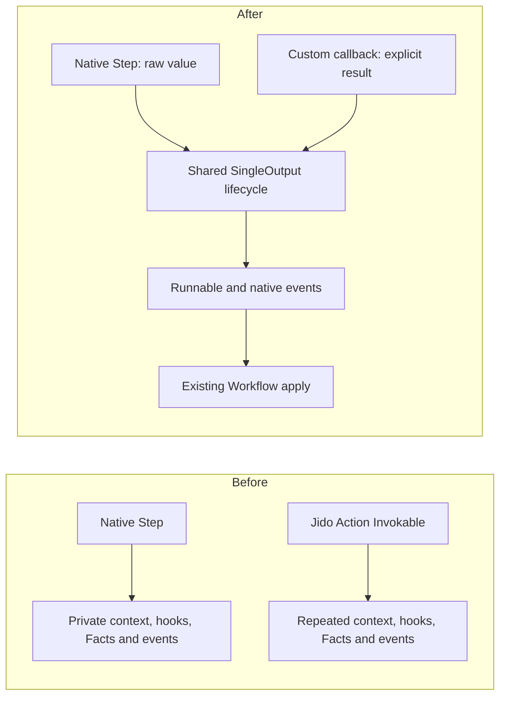
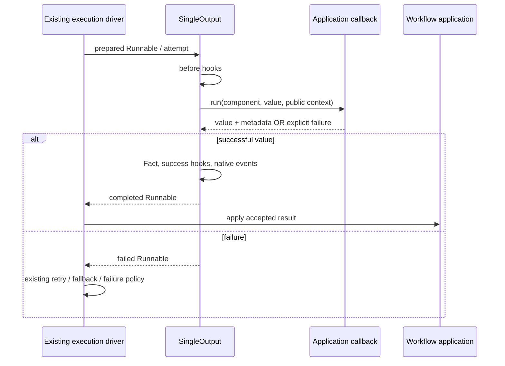

# Issue #32: shared ordinary component execution

Status: implemented for draft review; no Jido dependency migration or runtime rollout.
Base: `43b3c325744bdf36a2453fcbf54b04aaf8eb7803` (includes #29 and #38).
Tracks: [#32](https://github.com/zblanco/runic/issues/32), within [#30](https://github.com/zblanco/runic/issues/30).

## Decision

Introduce an opt-in `Runic.Workflow.SingleOutput` behaviour with one callback:
`run(component, input, context) -> Result.value(value, metadata: map) | Result.failure(reason)`.
The callback combines application work with explicit result interpretation.
The behaviour generates the existing `Invokable` implementation; it neither
changes `Component` nor requires a managed Runtime. Native Steps share the same
preparation and completion implementation while preserving raw return-as-data.

This moves knowledge, not just code. The callback cannot require event shapes,
ancestry depth, hook reducers, or private collection keys. Component identity,
source, configuration and ports remain in the existing composition boundary.
Specialized `Invokable` implementations remain available unchanged.

## Contracts and ownership

The public callback view contains existing runtime context, prepared meta
bindings, input metadata and activation/attempt correlation. It is transient,
not a portable request or a saved definition. It does not expose hooks or graph
state. Runic owns native Fact identity/ancestry; application metadata is explicit
and cannot overwrite the reserved `:runic` namespace.

Result interpretation is opt-in. A normal Step can still return an error tuple
as data. Invalid custom callback returns fail closed. Native process ownership,
timeouts, retry classification, Store acknowledgement and result correlation
remain the existing responsibilities below/around this callback.

The diagram's application is not a new durable commit boundary. The durable
Journal/ExecutionBackend plans remain future work; accepted execution is not an
Agent Turn commit or external effect acknowledgement.

## Important implementation details

- Step's compiled `CallContract` / `Invocation.Plan` remains internal and intact;
  ordinary arity-two functions are still positional. No signature guessing.
- Step's low-level legacy `Invokable.invoke/3` now delegates to the same phases,
  so before hooks and failures no longer bypass the ordinary lifecycle.
- Raises, throws and catchable exits become failed ordinary attempts. Hard kills
  still belong to the backend's owned task handling.
- Retries run the callback and before hooks again; failed attempts discard
  deferred hook reducers. Success hooks are not exactly-once side effects.
- Policy fallback values share native completion, including collection tracking,
  but preserve no-callback/no-hooks/empty-metadata semantics. Low-level specialized
  nodes retain their previous fallback path.
- Preparation recognizes native mapped paths and direct collector topology used
  by Jido's custom Map. It walks ancestry only for collection candidates, not
  every ordinary step. The shared FanOut-origin lookup also lets FanIn resolve
  FactRef ancestry without ancestor payload hydration; a regression test proves
  full collection completion across lightweight ancestors.
- No new event schema or persisted workflow field. Source/closures still rebuild
  components; lifecycle replay does not call application work. Module/config
  compatibility remains the application's deployment responsibility.

## Scope and compatibility

No dependencies, separate runtime package, Jido tuple matching in Runic, new
scheduler, sticky graph failure state, broker acknowledgement, or registry.
No complete empty-batch, nested-collection, local-value, outcome-observation or
dynamic-child design (#33–#37). No claim of exactly-once I/O.

The alpha-level behavior adjustments are deliberate: legacy Step invocation
uses ordinary hook/failure handling; catchable throws/exits become failed
Runnables; successful native fallback completion clears the previous error and
participates in collection tracking. Existing raw Step output meaning and
identity, macro closure reconstruction and calling conventions are preserved.

The standalone Scale example demonstrates a non-Jido consumer. The optional
Jido example uses real V3 Action validation, telemetry and error normalization
without event constructors. It is a portable, ordinary Action slice, not a
replacement compiler. Jido's current dependency still points at integration fork
`6b1c8c8`; the complete downstream adoption is a separate #293 change.

## Acceptance and evidence

Repository tests cover explicit failures/data, hook ordering and failures,
attempt identities, deferred hook changes, metadata, dynamic construction events,
source reconstruction, accepted-event replay, mapped/custom collector topology,
fallback collection completion, direct/managed execution, manual checkpoint and
fresh-context resume, and existing scheduler batching. The pre-change focused
baseline passed 144 tests. New contract tests first failed because the new
behaviour did not exist.

Final validation on the implementation:

- Full suite: **55 doctests, 1,591 tests, zero failures, 13 skips**, seed `905355`.
- New acceptance surface: **26 tests**, passing four consecutive runs with one
  BEAM scheduler, seed `684308`.
- Reproducible optional Jido check: **8 tests, zero failures**, seed `905355`,
  real Action `22f7c2a` with a path override to this Runic tree. It covers Action
  configuration identity, validation/error conversion, effects, reconstruction,
  managed execution, custom collections, retry telemetry, and accepted replay.
- Formatting (including optional example files), strict development/test
  compilation, and `git diff --check` pass.
- `mix docs --warnings-as-errors` generates documentation but fails on **22
  pre-existing hidden event-struct reference warnings** (11 repeated for HTML
  and EPUB). The sorted warning list is identical on unchanged upstream and
  this branch. No new documentation warning was introduced.

The optional command is `elixir examples/jido_action/check.exs`; it pins Jido's
revision and keeps that dependency out of Runic's default suite. This is not the
whole Jido suite, AgentServer adoption, a clean-node release upgrade, or production
evidence. No database, broker, multi-node or performance claim is made.

See [the consumer guide](../guides/custom-components.md) for the public contract.
