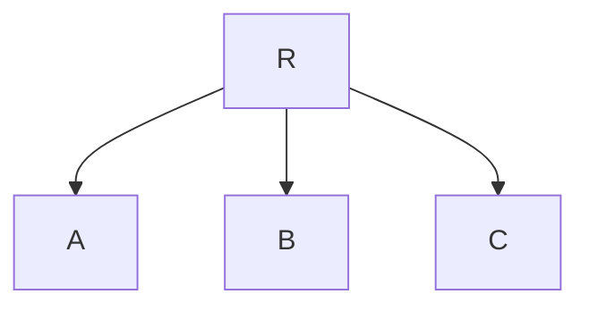
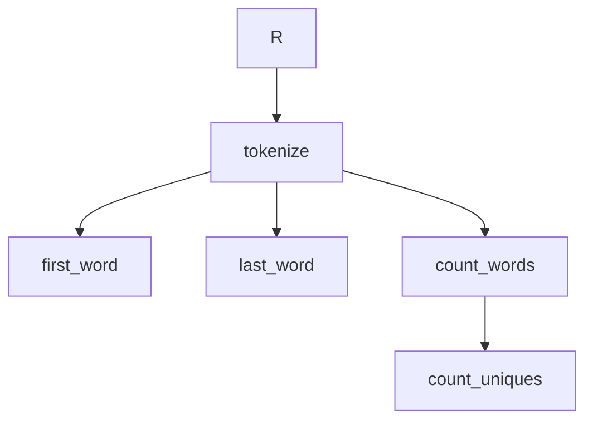

<!-- MDOC !-->

# Runic

Runic is a tool for modeling programs as data driven workflows that can be composed together at runtime.

Runic components connect together in a `Runic.Workflow` supporting lazily evaluated concurrent execution.

Runic Workflows are modeled as a decorated dataflow graph (a DAG - "directed acyclic graph") compiled from components such as steps, rules, pipelines, and state machines and more allowing coordinated interaction of disparate parts.

## Installation

If [available in Hex](https://hex.pm/docs/publish), the package can be installed
by adding `runic` to your list of dependencies in `mix.exs`:

```elixir
def deps do
  [
    {:runic, "~> 0.1.0-alpha"}
  ]
end
```

Documentation can be generated with [ExDoc](https://github.com/elixir-lang/ex_doc)
and published on [HexDocs](https://hexdocs.pm). Once published, the docs can
be found at <https://hexdocs.pm/runic>.

## Concepts

Data flow dependencies between Lambda expressions, common in ETL pipelines, can be built with `%Step{}` components.

A Lambda Steps is a simple `input -> output` function.

```elixir
require Runic

step = Runic.step(fn x -> x + 1 end)
```

Steps are composable in a workflow:

```elixir
workflow = Runic.workflow(
  name: "example pipeline workflow",
  steps: [
    Runic.step(fn x -> x + 1 end), #A
    Runic.step(fn x -> x * 2 end), #B
    Runic.step(fn x -> x - 1 end) #C
  ]
)
```

This produces a workflow graph where R is the entrypoint or "root" of the tree:



In Runic, inputs flow through a workflow as a `%Fact{}`. During workflow evaluation various steps are traversed to and invoked producing more Facts.

```elixir
alias Runic.Workflow

workflow
|> Workflow.react_until_satisfied(2)
|> Workflow.raw_productions()

[3, 4, 1]
```

A core benefit Runic workflows are modeling pipelines that aren't just linear. For example:

```elixir
defmodule TextProcessing do
  def tokenize(text) do
    text
    |> String.downcase()
    |> String.split(~R/[^[:alnum:]\-]/u, trim: true)
  end

  def count_words(list_of_words) do
    list_of_words
    |> Enum.reduce(Map.new(), fn word, map ->
      Map.update(map, word, 1, &(&1 + 1))
    end)
  end

  def count_uniques(word_count) do
    Enum.count(word_count)
  end

  def first_word(list_of_words) do
    List.first(list_of_words)
  end

  def last_word(list_of_words) do
    List.last(list_of_words)
  end
end
```

Notice we have 3 functions that expect a `list_of_words`. In Elixir if we wanted to evaluate each output we can pipe them together the pipeline `|>` operator...

```elixir
import TextProcessing

word_count = 
  "anybody want a peanut?"
  |> tokenize()
  |> count_words()

first_word = 
  "anybody want a peanut?"
  |> tokenize()
  |> first_word()

last_word = 
  "anybody want a peanut?"
  |> tokenize()
  |> last_word()
```

However we're now evaluating linearly: using the common `tokenize/1` function 3 times for the same input text.

This could be problematic if `tokenize/1` is expensive - we'd prefer to run `tokenize/1` just once and then fed into the rest of our pipeline.

With Runic we can compose all of these steps into one workflow and evaluate them together.

```elixir
text_processing_workflow = 
  Runic.workflow(
    name: "basic text processing example",
    steps: [
      {Runic.step(&tokenize/1),
        [
          {Runic.step(&count_words/1),
          [
            Runic.step(&count_uniques/1)
          ]},
          Runic.step(&first_word/1),
          Runic.step(&last_word/1)
        ]}
    ]
  )
```

Our text processing workflow graph now looks something like this:



Now Runic can traverse over the graph of dataflow connections only evaluating `tokenize/1` once for all three dependent steps.

```elixir
alias Runic.Workflow

text_processing_workflow 
|> Workflow.react_until_satisfied("anybody want a peanut?") 
|> Workflow.raw_productions()

[
  ["anybody", "want", "a", "peanut"], 
  "anybody", 
  "peanut", 
  4,
  %{"a" => 1, "anybody" => 1, "peanut" => 1, "want" => 1}
]
```

Beyond steps, Runic has support for Rules, Joins, and State Machines for more complex control flow and stateful evaluation.

The `Runic.Workflow.Invokable` protocol is what allows for extension of Runic's runtime supporting nodes with different execution properties and evaluation. 

The `Runic.Component` protocol supports extension of modeling new components that can be added and connected with other components in Runic workflows.

## Runtime Workflow Composition

Workflows can be composed dynamically at runtime:

```elixir
require Runic
alias Runic.Workflow

# Using Workflow.add/3 for dynamic composition
workflow = Runic.workflow()
  |> Workflow.add(Runic.step(fn x -> x + 1 end, name: :add))
  |> Workflow.add(Runic.step(fn x -> x * 2 end, name: :double), to: :add)

# Merge two workflows together
workflow1 = Runic.workflow(steps: [Runic.step(fn x -> x + 1 end)])
workflow2 = Runic.workflow(steps: [Runic.step(fn x -> x * 2 end)])
combined = Workflow.merge(workflow1, workflow2)

# Join multiple parent nodes
workflow = workflow
  |> Workflow.add(Runic.step(fn a, b -> a + b end, name: :join), to: [:branch_a, :branch_b])
```

See `Runic.Workflow` module documentation for adding components to workflows and running them.

## Three-Phase Execution Model

Runic's Invokable protocol enforces a three-phase execution model designed for parallel execution and external scheduling:

1. **Prepare** - Extract minimal context from the workflow into `%Runnable{}` structs
2. **Execute** - Run runnables containing work functions and their inputs in isolation (can be parallelized)
3. **Apply** - Reduce results back into the workflow so next steps can be determined

### Parallel Execution

For workflows where nodes can execute concurrently:

```elixir
alias Runic.Workflow

# Execute runnables in parallel with configurable concurrency
workflow
|> Workflow.react_until_satisfied_parallel(input, max_concurrency: 8) # Task.async_stream options
|> Workflow.raw_productions()
```

### External Scheduler Integration

For custom schedulers, worker pools, or distributed execution:

```elixir
defmodule MyApp.WorkflowScheduler do
  use GenServer
  alias Runic.Workflow
  alias Runic.Workflow.Invokable

# Phase 1: Prepare runnables for dispatch
  def handle_cast({:run, input}, %{workflow: workflow} = state) do
    workflow = 
      workflow
      |> Workflow.plan_eagerly(input)
      |> dispatch_tasks()

    {:noreply, %{state | workflow: workflow}}
  end

  # Phase 2: Execute (dispatch to async worker pool, queue, external service, etc.)
  defp dispatch_tasks(workflow) do
    {workflow, runnables} = Workflow.prepare_for_dispatch(workflow)

    Enum.map(runnables, fn runnable -> 
      Task.async(fn ->
        # consider logging, error handling, retries here
        Invokable.execute(runnable.node, runnable)
      end)
    end)

    workflow
  end

  # Phase 3: Apply results back to workflow by handling async task callbacks with excecuted runnable
  def handle_info({ref, executed_runnable}, %{workflow: workflow} = state) do
    new_workflow =
      Enum.reduce(executed, workflow, fn {:ok, runnable}, wrk ->
        Workflow.apply_runnable(wrk, runnable)
      end)

    workflow = 
      if Workflow.is_runnable?(new_workflow) do
        dispatch_tasks(workflow)
      end

    {:noreply, %{state | workflow: workflow}}
  end
end
```

Key APIs for external scheduling:

- `Workflow.prepare_for_dispatch/1` - Returns `{workflow, [%Runnable{}]}` for dispatch
- `Workflow.apply_runnable/2` - Applies a completed runnable back to the workflow
- `Invokable.execute/2` - Executes a runnable in isolation (no workflow access)

In summary, the `Runic` module provides high level functions and macros for building Runic Components
  such as Steps, Rules, Workflows, and Accumulators.

The `Runic.Workflow` module is for connecting components together and running them with inputs.

Runic was designed to be used with custom process topologies and libraries such as GenStage, Broadway, and Flow without coupling you to one runtime model or a limited set of adapters.

Runic has first class support for dynamic runtime composition of workflows.

Runic is useful in problems where a developer cannot know upfront the logic or data flow in compiled code  such as expert systems, user DSLs like Excel spreadsheets, low/no-code tools, or dynamic data pipelines.

If the runtime modification of a workflow or complex parallel dataflow evaluation isn't something your use case requires you might not need Runic.

Runic Workflows are essentially a dataflow based virtual machine running within Elixir and will not be faster than compiled Elixir code. If you know the flow of the program upfront during development you might not need Runic.

## Scheduler Policies

Runic workflows support declarative per-node scheduling policies for retries, timeouts, backoff, fallbacks, and failure handling — without modifying the `Invokable` protocol or existing component structs.

Policies are stored on the workflow as a list of `{matcher, policy_map}` rules resolved at execution time. The first matching rule wins:

```elixir
alias Runic.Workflow
alias Runic.Workflow.SchedulerPolicy

workflow =
  workflow
  |> Workflow.add_scheduler_policy(:call_llm, %{
    max_retries: 3,
    backoff: :exponential,
    timeout_ms: 30_000
  })
  |> Workflow.append_scheduler_policy(:default, %{timeout_ms: 10_000})

# Policies are applied automatically during react/react_until_satisfied
workflow |> Workflow.react_until_satisfied(input)

# Runtime overrides can be passed as options (prepended with higher priority)
workflow |> Workflow.react_until_satisfied(input,
  scheduler_policies: [{:flaky_step, %{max_retries: 5}}]
)
```

Policy matchers support exact name atoms, regex (`{:name, ~r/^llm_/}`), type matching (`{:type, Step}`), custom predicates (`fn node -> ... end`), and `:default` catch-alls. Backoff strategies include `:none`, `:linear`, `:exponential`, and `:jitter`.

See `Runic.Workflow.SchedulerPolicy` for the full policy struct and matcher documentation, and `Runic.Workflow.PolicyDriver` for execution driver details.

## Built-in Runner

`Runic.Runner` provides batteries-included workflow execution infrastructure: a supervision tree with a `DynamicSupervisor` for workers, `Task.Supervisor` for fault-isolated dispatch, `Registry` for lookup, and pluggable persistence via `Runic.Runner.Store`.

```elixir
# Start a runner in your supervision tree
{:ok, _} = Runic.Runner.start_link(name: MyApp.Runner)

# Start and run a workflow
{:ok, _pid} = Runic.Runner.start_workflow(MyApp.Runner, :order_123, workflow)
:ok = Runic.Runner.run(MyApp.Runner, :order_123, input)

# Query results
{:ok, results} = Runic.Runner.get_results(MyApp.Runner, :order_123)

# Resume from persisted state after a crash
{:ok, _pid} = Runic.Runner.resume(MyApp.Runner, :order_123)
```

Workers automatically integrate with scheduler policies, dispatch runnables to supervised tasks with configurable `max_concurrency`, and support checkpointing strategies (`:every_cycle`, `:on_complete`, `{:every_n, n}`, `:manual`).

Built-in store adapters: `Runic.Runner.Store.ETS` (default, in-memory) and `Runic.Runner.Store.Mnesia` (disk-persistent, distributed). Custom adapters implement the `Runic.Runner.Store` behaviour.

Telemetry events are emitted under `[:runic, :runner, ...]` for workflow lifecycle, runnable dispatch/completion, and store operations. See `Runic.Runner.Telemetry` for the full event catalog.

## Guides

For quick reference and best practices:

- [**Cheatsheet**](guides/cheatsheet.md) - Quick reference for all core APIs
- [**Usage Rules**](guides/usage-rules.md) - Core concepts, do's/don'ts, and patterns
- [**Protocols**](guides/protocols.md) - Extending Runic with custom components and execution behavior
- [**Building a Workflow Scheduler**](guides/scheduling.md) - From simple spawned processes to production GenServer schedulers
- [**Durable Execution**](guides/durable-execution.md) - Persistence, crash recovery, and checkpointing with the Runner

