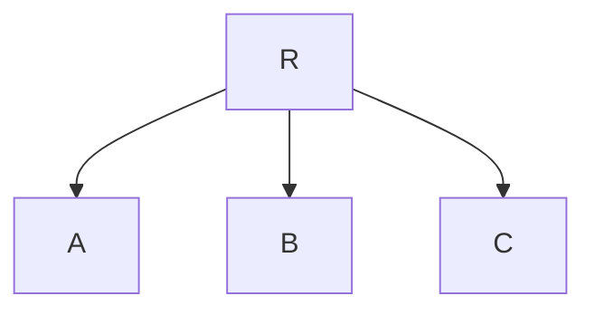
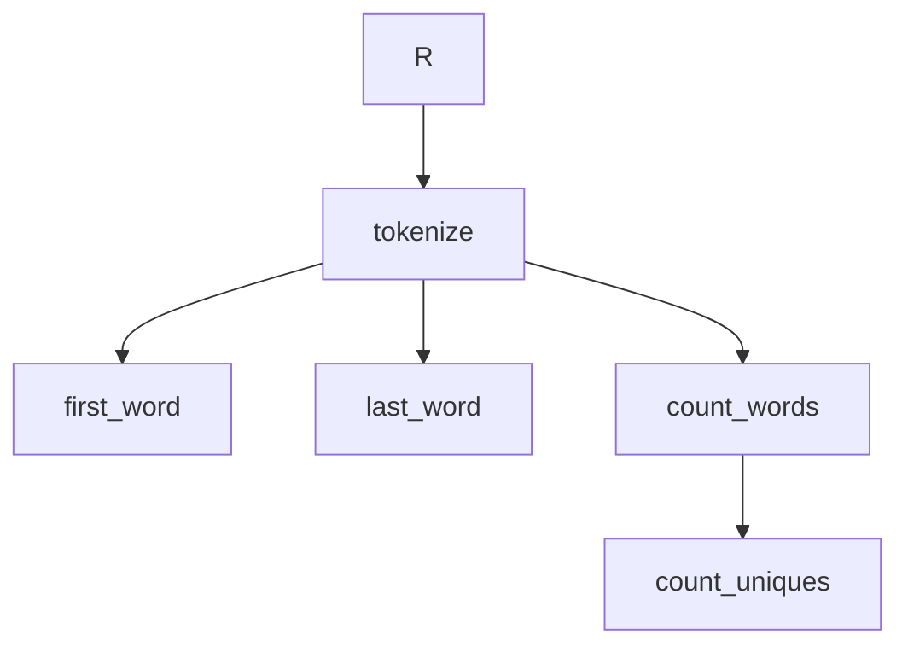

<!-- MDOC !-->

# Runic

Runic is a tool for modeling your workflows as data that can be composed together at runtime.

Runic components can be integrated into a Runic.Workflow and evaluated lazily in concurrent contexts.

Runic Workflows are a decorated dataflow graph (a DAG - "directed acyclic graph") capable of modeling rules, pipelines, and state machines and more.

Basic data flow dependencies such as in a pipeline are modeled as `%Step{}` structs (nodes/vertices) in the graph with directed edges (arrows) between steps.

A step can be thought of as a simple input -> output lambda function. e.g.

```elixir
require Runic

step = Runic.step(fn x -> x + 1 end)
```

And since steps are composable, you can integrate them together in a workflow:

```elixir
workflow = Runic.workflow(
  name: "example pipeline workflow",
  steps: [
    Runic.step(fn x -> x + 1 end), #A
    Runic.step(fn x -> x * 2 end), #B
    Runic.step(fn x -> x - 1 end) #C
  ]
)
```

This produces a workflow graph like the following where R is the entrypoint or "root" of the tree:



In Runic, inputs fed through a workflow are called "Facts". During workflow evaluation various steps are traversed to and invoked producing more Facts.

```elixir
alias Runic.Workflow

workflow
|> Workflow.react_until_satisfied(2)
|> Workflow.raw_productions()

[3, 4, 1]
```

However we can go further with this dataflow idea and make pipelines with Runic that aren't just linear. We'll start by defining some functions. 

```elixir
defmodule TextProcessing do
  def tokenize(text) do
    text
    |> String.downcase()
    |> String.split(~R/[^[:alnum:]\-]/u, trim: true)
  end

  def count_words(list_of_words) do
    list_of_words
    |> Enum.reduce(Map.new(), fn word, map ->
      Map.update(map, word, 1, &(&1 + 1))
    end)
  end

  def count_uniques(word_count) do
    Enum.count(word_count)
  end

  def first_word(list_of_words) do
    List.first(list_of_words)
  end

  def last_word(list_of_words) do
    List.last(list_of_words)
  end
end
```

Notice we have 3 functions that expect a `list_of_words`. In Elixir if we wanted to evaluate each output we can pipe them together the `|>` expression...

```elixir
import TextProcessing

word_count = 
  "anybody want a peanut?"
  |> tokenize()
  |> count_words()

first_word = 
  "anybody want a peanut?"
  |> tokenize()
  |> first_word()

last_word = 
  "anybody want a peanut?"
  |> tokenize()
  |> last_word()
```

However in evaluating these linearly we've used the common `tokenize/1` function 3 times for the same input text.

This could be problematic if `tokenize/1` is expensive - we'd prefer to run it just once and then fed into the rest of our pipeline.

With Runic we can compose all of these steps into one workflow and evaluate them together.

```elixir
text_processing_workflow = 
  Runic.workflow(
    name: "basic text processing example",
    steps: [
      {Runic.step(&tokenize/1),
        [
          {Runic.step(&count_words/1),
          [
            Runic.step(&count_uniques/1)
          ]},
          Runic.step(&first_word/1),
          Runic.step(&last_word/1)
        ]}
    ]
  )
```

Our text processing workflow graph now looks something like this:



Now Runic can traverse over the graph of dataflow connections only evaluating `tokenize/1` once for all three dependent steps.

```elixir
alias Runic.Workflow

text_processing_workflow 
|> Workflow.react_until_satisfied("anybody want a peanut?") 
|> Workflow.raw_productions()

[
  ["anybody", "want", "a", "peanut"], 
  "anybody", 
  "peanut", 
  4,
  %{"a" => 1, "anybody" => 1, "peanut" => 1, "want" => 1}
]
```

Beyond steps, Runic has support for Rules, Joins, and State Machines for more complex control flow and stateful evaluation.

The Runic.Workflow.Invokable protocol is what allows for extension of Runic and composability
  of structures like Workflows, Steps, Rules, and Accumulators by allowing user defined structures to be integrated into a `Runic.Workflow`.

See the Runic.Workflow module for more information about evaluation APIs.

## Three-Phase Execution Model

Runic supports a three-phase execution model designed for parallel execution and external scheduling:

1. **Prepare** - Extract minimal context from the workflow into `%Runnable{}` structs
2. **Execute** - Run node work functions in isolation (can be parallelized)
3. **Apply** - Reduce results back into the workflow

### Parallel Execution

For workflows where nodes can execute concurrently:

```elixir
alias Runic.Workflow

# Execute runnables in parallel with configurable concurrency
workflow
|> Workflow.react_until_satisfied_parallel(input, max_concurrency: 8)
|> Workflow.raw_productions()
```

### External Scheduler Integration

For custom schedulers, worker pools, or distributed execution:

```elixir
defmodule MyApp.WorkflowScheduler do
  use GenServer
  alias Runic.Workflow
  alias Runic.Workflow.Invokable

  def handle_cast({:run, input}, %{workflow: workflow} = state) do
    # Phase 1: Prepare runnables for dispatch
    workflow = Workflow.plan_eagerly(workflow, input)
    {workflow, runnables} = Workflow.prepare_for_dispatch(workflow)

    # Phase 2: Execute (dispatch to worker pool, external service, etc.)
    executed =
      Task.async_stream(runnables, fn runnable ->
        Invokable.execute(runnable.node, runnable)
      end, timeout: :infinity)

    # Phase 3: Apply results back to workflow
    workflow =
      Enum.reduce(executed, workflow, fn {:ok, runnable}, wrk ->
        Workflow.apply_runnable(wrk, runnable)
      end)

    # Continue if more work is available
    if Workflow.is_runnable?(workflow) do
      GenServer.cast(self(), :continue)
    end

    {:noreply, %{state | workflow: workflow}}
  end
end
```

Key APIs for external scheduling:

- `Workflow.prepare_for_dispatch/1` - Returns `{workflow, [%Runnable{}]}` for dispatch
- `Workflow.apply_runnable/2` - Applies a completed runnable back to the workflow
- `Invokable.execute/2` - Executes a runnable in isolation (no workflow access)

This top level module provides high level functions and macros for building Runic Components
  such as Steps, Rules, Workflows, and Accumulators.

Runic was designed to be used with custom process topologies and/or libraries such as GenStage, Broadway, and Flow.

Runic is meant for dynamic runtime modification of a workflow where you might want to compose pieces of a workflow together at runtime.

These sorts of use cases are common in expert systems, user DSLs (e.g. Excel, low-code tools) where a developer cannot know
  upfront the logic or data flow to be expressed in compiled code.

If the runtime modification of a workflow or complex parallel dataflow evaluation isn't something your use case requires you might not need Runic and vanilla compiled Elixir code will be faster and simpler.

Runic Workflows are essentially a dataflow based virtual machine running within Elixir and will not be faster than compiled Elixir code.

## Installation

If [available in Hex](https://hex.pm/docs/publish), the package can be installed
by adding `runic` to your list of dependencies in `mix.exs`:

```elixir
def deps do
  [
    {:runic, "~> 0.1.0"}
  ]
end
```

Documentation can be generated with [ExDoc](https://github.com/elixir-lang/ex_doc)
and published on [HexDocs](https://hexdocs.pm). Once published, the docs can
be found at <https://hexdocs.pm/runic>.

