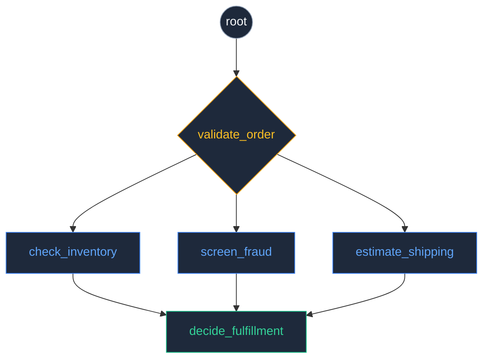
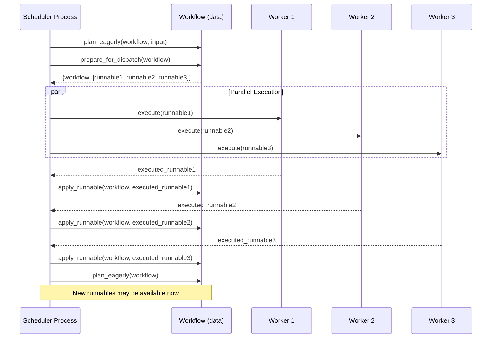
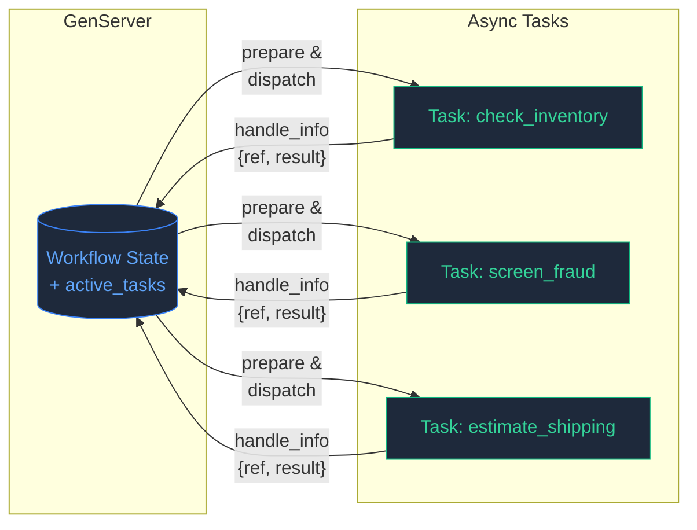
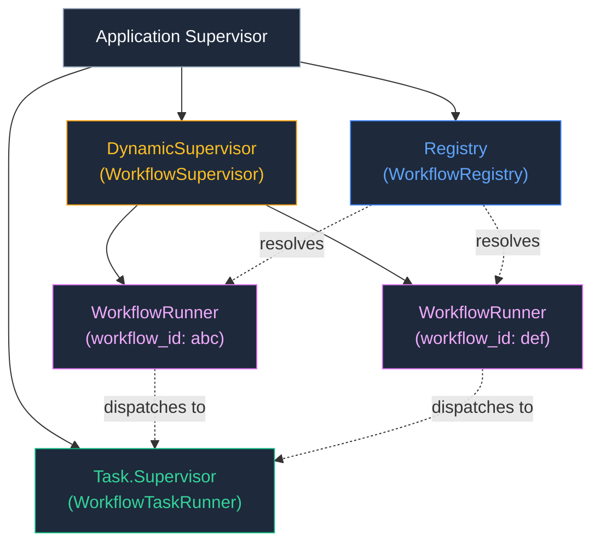
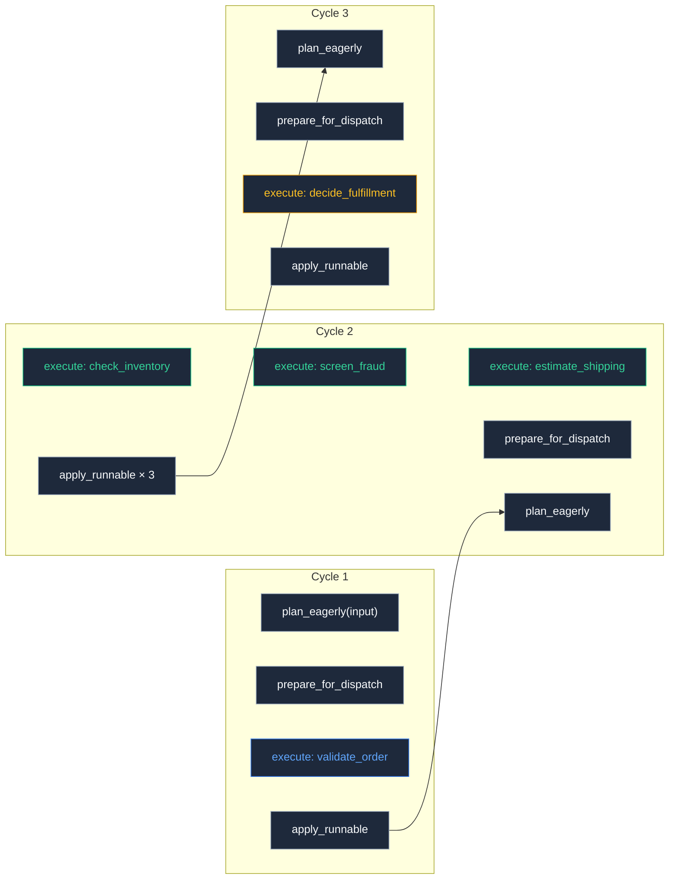

# Building a Workflow Scheduler

This guide walks you through building your own scheduler for Runic workflows, starting from a simple `spawn`-based approach and evolving toward a production-ready, dynamically supervised GenServer that dispatches work to async tasks.

Runic workflows are **process-agnostic data structures**. The three-phase execution model — **prepare**, **execute**, **apply** — gives you full control over _how_ and _where_ work runs. This guide shows you how to exploit that design to build schedulers that coordinate dataflow-parallel execution across Elixir processes.

> **Prerequisites**: Familiarity with Runic basics (steps, rules, workflows) covered in the [Cheatsheet](cheatsheet.html) and [Usage Rules](usage-rules.html). Basic knowledge of Elixir processes, GenServer, and OTP supervisors.

## The Example Workflow: Order Fulfillment Pipeline

We'll use a practical order fulfillment pipeline throughout this guide. It validates an incoming order, then fans out into three independent operations — inventory check, fraud screening, and shipping estimate — before joining the results and producing a fulfillment decision. This structure naturally exposes opportunities for parallel execution.

```elixir
require Runic
alias Runic.Workflow

validate_order = Runic.rule(
  condition: fn %{items: items, customer_id: cid} when is_list(items) and is_binary(cid) -> true end,
  reaction: fn order -> order end,
  name: :validate_order
)

check_inventory = Runic.step(
  fn order ->
    # Simulate I/O: warehouse API call
    Process.sleep(200)
    %{order_id: order.customer_id, inventory: :in_stock}
  end,
  name: :check_inventory
)

screen_fraud = Runic.step(
  fn order ->
    Process.sleep(300)
    %{order_id: order.customer_id, risk: :low}
  end,
  name: :screen_fraud
)

estimate_shipping = Runic.step(
  fn order ->
    Process.sleep(150)
    %{order_id: order.customer_id, days: 3, cost: 5.99}
  end,
  name: :estimate_shipping
)

decide_fulfillment = Runic.step(
  fn inventory, fraud, shipping ->
    %{
      approved: inventory.inventory == :in_stock and fraud.risk == :low,
      shipping_days: shipping.days,
      shipping_cost: shipping.cost
    }
  end,
  name: :decide_fulfillment
)

workflow =
  Runic.workflow(name: :order_fulfillment, rules: [validate_order])
  |> Workflow.add(check_inventory, to: :validate_order)
  |> Workflow.add(screen_fraud, to: :validate_order)
  |> Workflow.add(estimate_shipping, to: :validate_order)
  |> Workflow.add(decide_fulfillment, to: [:check_inventory, :screen_fraud, :estimate_shipping])
```

The workflow graph looks like this:



After validation, the three checks are _independent_ — they share no data dependencies and can execute concurrently. The join step (`decide_fulfillment`) waits for all three before firing. Running these sequentially wastes time. A scheduler that understands this structure can dispatch them in parallel.

## The Three-Phase Dispatch Model

Before building schedulers, it's important to understand _why_ the three-phase model exists and how it enables process-level parallelism.



### Phase 1: Prepare

`Workflow.prepare_for_dispatch/1` walks the workflow graph and extracts each ready node-fact pair into a `%Runnable{}` struct. The Runnable captures everything needed to execute the node's work function _without access to the workflow_:

```elixir
{workflow, runnables} = Workflow.prepare_for_dispatch(workflow)
```

The returned workflow may have been updated (some nodes may be skipped or deferred during preparation), so always use the returned workflow going forward.

### Phase 2: Execute

Each `%Runnable{}` can be executed in complete isolation. The node's work function runs using only the data captured in the Runnable — no workflow reference needed:

```elixir
executed = Runic.Workflow.Invokable.execute(runnable.node, runnable)
# or equivalently:
executed = Workflow.execute_runnable(runnable)
```

This isolation is the key enabler of parallelism. Because execute has no side effects on the workflow, you can run multiple executions concurrently across tasks, processes, or even remote nodes.

### Phase 3: Apply

After execution, the completed Runnable carries an `apply_fn` — a closure that knows how to reduce the result back into the workflow graph:

```elixir
workflow = Workflow.apply_runnable(workflow, executed)
```

This phase _must_ be sequential per workflow. The workflow is a single data structure, and apply mutates it (functionally) by adding produced facts and preparing the next generation of runnables.

After applying, call `plan_eagerly/1` to discover newly available runnables downstream and repeat the cycle.

## Step 1: The Simplest Scheduler — A Spawned Process

The most basic scheduler is a spawned process that runs the three-phase loop:

```elixir
defmodule SimpleScheduler do
  alias Runic.Workflow

  def run(workflow, input) do
    pid = spawn(fn -> loop(Workflow.plan_eagerly(workflow, input)) end)
    pid
  end

  defp loop(workflow) do
    if Workflow.is_runnable?(workflow) do
      {workflow, runnables} = Workflow.prepare_for_dispatch(workflow)

      workflow =
        Enum.reduce(runnables, workflow, fn runnable, wrk ->
          executed = Workflow.execute_runnable(runnable)
          Workflow.apply_runnable(wrk, executed)
        end)

      workflow
      |> Workflow.plan_eagerly()
      |> loop()
    else
      send(self(), {:workflow_complete, workflow})
      workflow
    end
  end
end
```

This works, but it executes runnables sequentially within each cycle. The three independent steps (inventory, fraud, shipping) run one after another even though they have no data dependencies. The total time is the _sum_ of all step durations rather than the _maximum_.

Still, notice the core pattern that every scheduler follows:

1. **Plan** — `plan_eagerly/1` discovers what's ready
2. **Prepare** — `prepare_for_dispatch/1` extracts runnables
3. **Execute** — run each runnable's work function
4. **Apply** — `apply_runnable/2` folds results back in
5. **Loop** — repeat until `is_runnable?/1` returns `false`

## Step 2: Adding Parallel Execution with Tasks

The execute phase is embarrassingly parallel. Let's use `Task.async_stream` to run independent runnables concurrently:

```elixir
defmodule ParallelScheduler do
  alias Runic.Workflow

  def run(workflow, input) do
    spawn(fn ->
      workflow
      |> Workflow.plan_eagerly(input)
      |> loop()
    end)
  end

  defp loop(workflow) do
    if Workflow.is_runnable?(workflow) do
      {workflow, runnables} = Workflow.prepare_for_dispatch(workflow)

      workflow =
        runnables
        |> Task.async_stream(
          fn runnable -> Workflow.execute_runnable(runnable) end,
          timeout: :infinity,
          max_concurrency: System.schedulers_online()
        )
        |> Enum.reduce(workflow, fn {:ok, executed}, wrk ->
          Workflow.apply_runnable(wrk, executed)
        end)

      workflow
      |> Workflow.plan_eagerly()
      |> loop()
    else
      workflow
    end
  end
end
```

Now the three independent checks run concurrently. Total time for that cycle is `max(200, 300, 150) = 300ms` instead of `200 + 300 + 150 = 650ms`.

However, `Task.async_stream` blocks until _all_ tasks in the batch complete before we can apply any results. If one task finishes in 50ms and another takes 10 seconds, the fast result sits idle. For truly responsive scheduling, we need asynchronous dispatch.

## Step 3: A GenServer Scheduler with Async Dispatch

A GenServer gives us a stateful process that can dispatch tasks asynchronously and react to their completions individually via `handle_info`. This is where the three-phase model truly shines.



The core idea:

- On `:run` — plan the workflow, prepare runnables, and dispatch each as an async `Task`
- On task completion — `handle_info` receives the result, applies it, re-plans, and dispatches any newly available runnables
- The workflow progresses incrementally as results arrive rather than waiting for an entire batch

```elixir
defmodule WorkflowScheduler do
  use GenServer

  alias Runic.Workflow
  require Logger

  # --- Client API ---

  def start_link(workflow, opts \\ []) do
    GenServer.start_link(__MODULE__, workflow, opts)
  end

  def run(pid, input) do
    GenServer.cast(pid, {:run, input})
  end

  def get_workflow(pid) do
    GenServer.call(pid, :get_workflow)
  end

  def get_results(pid) do
    GenServer.call(pid, :get_results)
  end

  # --- Server Callbacks ---

  @impl true
  def init(workflow) do
    state = %{
      workflow: workflow,
      active_tasks: MapSet.new(),
      dispatched_tasks: MapSet.new()
    }

    {:ok, state}
  end

  @impl true
  def handle_cast({:run, input}, state) do
    workflow = Workflow.plan_eagerly(state.workflow, input)
    state = %{state | workflow: workflow}
    state = dispatch_runnables(state)
    {:noreply, state}
  end

  @impl true
  def handle_call(:get_workflow, _from, state) do
    {:reply, state.workflow, state}
  end

  @impl true
  def handle_call(:get_results, _from, state) do
    {:reply, Workflow.raw_productions(state.workflow), state}
  end

  @impl true
  def handle_info({ref, executed_runnable}, state) do
    Process.demonitor(ref, [:flush])

    Logger.info("Runnable completed: #{inspect(executed_runnable.node.name)}")

    workflow =
      state.workflow
      |> Workflow.apply_runnable(executed_runnable)
      |> Workflow.plan_eagerly()

    state = %{
      state
      | workflow: workflow,
        active_tasks: MapSet.delete(state.active_tasks, executed_runnable.id)
    }

    state =
      if Workflow.is_runnable?(workflow) do
        dispatch_runnables(state)
      else
        Logger.info("Workflow satisfied — no more runnables")
        state
      end

    {:noreply, state}
  end

  @impl true
  def handle_info({:DOWN, _ref, :process, _pid, _reason}, state) do
    {:noreply, state}
  end

  # --- Internal ---

  defp dispatch_runnables(state) do
    {workflow, runnables} = Workflow.prepare_for_dispatch(state.workflow)

    already_dispatched = MapSet.union(state.active_tasks, state.dispatched_tasks)

    Enum.reduce(runnables, %{state | workflow: workflow}, fn runnable, acc ->
      if runnable.id in already_dispatched do
        acc
      else
        Task.async(fn ->
          Workflow.execute_runnable(runnable)
        end)

        %{
          acc
          | active_tasks: MapSet.put(acc.active_tasks, runnable.id),
            dispatched_tasks: MapSet.put(acc.dispatched_tasks, runnable.id)
        }
      end
    end)
  end
end
```

### Why Track `active_tasks` and `dispatched_tasks`?

The `active_tasks` set tracks runnables currently in-flight. The `dispatched_tasks` set is a historical record of everything ever dispatched. Together they prevent duplicate dispatch — without them, `prepare_for_dispatch/1` could return the same runnable again before the first execution completes, leading to redundant work. After a task completes, its ID is removed from `active_tasks` but stays in `dispatched_tasks` as a guard.

### The `handle_info` Callback Pattern

When you call `Task.async/1` from a GenServer, the task sends its result as a message `{ref, result}` to the calling process. The GenServer's `handle_info/2` receives this message, giving you the executed runnable. The pattern is:

1. **Demonitor** the task reference (we handle the result directly)
2. **Apply** the executed runnable to the workflow
3. **Re-plan** with `plan_eagerly/1` to discover downstream runnables
4. **Dispatch** any newly available runnables

This creates a reactive loop where the workflow advances incrementally as each task completes, maximizing throughput.

## Step 4: Supervised Tasks and Dynamic Registration

The previous GenServer uses bare `Task.async`, which links the task to the GenServer. If a task crashes, the GenServer crashes too. For production use, we want:

- **Task.Supervisor** — isolates task failures from the scheduler (or a Task PartitionSupervisor)
- **DynamicSupervisor** — manages multiple scheduler instances
- **Registry** — enables looking up schedulers by workflow ID



### The Supervision Tree

```elixir
defmodule MyApp.WorkflowSupervisor do
  use DynamicSupervisor

  def start_link(_opts) do
    DynamicSupervisor.start_link(__MODULE__, [], name: __MODULE__)
  end

  @impl true
  def init(_opts) do
    DynamicSupervisor.init(strategy: :one_for_one)
  end

  def find(workflow_id) do
    workflow_id
    |> MyApp.WorkflowRunner.via()
    |> GenServer.whereis()
  end
end
```

### The Production WorkflowRunner

```elixir
defmodule MyApp.WorkflowRunner do
  use GenServer, restart: :transient, shutdown: 60_000

  alias Runic.Workflow
  require Logger

  # --- Registry-based naming ---

  def via(workflow_id) when is_binary(workflow_id) do
    {:via, Registry, {MyApp.WorkflowRegistry, {__MODULE__, workflow_id}}}
  end

  # --- Client API ---

  def start(workflow, workflow_id) do
    session = %{id: workflow_id, workflow: workflow}

    DynamicSupervisor.start_child(
      MyApp.WorkflowSupervisor,
      {__MODULE__, session}
    )
  end

  def run(workflow_id, input) do
    GenServer.cast(via(workflow_id), {:run, input})
  end

  def get_results(workflow_id) do
    workflow_id
    |> via()
    |> GenServer.call(:get_results)
  end

  def get_workflow(workflow_id) do
    GenServer.call(via(workflow_id), :get_workflow)
  end

  def stop(workflow_id) do
    case MyApp.WorkflowSupervisor.find(workflow_id) do
      nil -> :ok
      pid -> DynamicSupervisor.terminate_child(MyApp.WorkflowSupervisor, pid)
    end
  end

  # --- Child spec & init ---

  def child_spec(%{id: workflow_id} = session) do
    %{
      id: {__MODULE__, workflow_id},
      start: {__MODULE__, :start_link, [session]},
      restart: :transient
    }
  end

  def start_link(%{id: workflow_id} = session) do
    GenServer.start_link(__MODULE__, session, name: via(workflow_id))
  end

  @impl true
  def init(%{workflow: %Workflow{}} = session) do
    state =
      session
      |> Map.put(:active_tasks, MapSet.new())
      |> Map.put(:dispatched_tasks, MapSet.new())

    {:ok, state}
  end

  # --- Callbacks ---

  @impl true
  def handle_cast({:run, input}, state) do
    workflow = Workflow.plan_eagerly(state.workflow, input)
    state = %{state | workflow: workflow}
    state = dispatch_runnables(state)
    {:noreply, state}
  end

  @impl true
  def handle_call(:get_workflow, _from, state) do
    {:reply, state.workflow, state}
  end

  @impl true
  def handle_call(:get_results, _from, state) do
    results = Workflow.productions_by_component(state.workflow)

    {:reply, results, state}
  end

  @impl true
  def handle_info({ref, executed_runnable}, state) do
    Process.demonitor(ref, [:flush])

    Logger.info("Completed: #{inspect(executed_runnable.node.name)}")

    workflow =
      state.workflow
      |> Workflow.apply_runnable(executed_runnable)
      |> Workflow.plan_eagerly()

    state = %{
      state
      | workflow: workflow,
        active_tasks: MapSet.delete(state.active_tasks, executed_runnable.id)
    }

    state =
      if Workflow.is_runnable?(workflow) do
        dispatch_runnables(state)
      else
        Logger.info("Workflow #{state.id} resolved")
        state
      end

    {:noreply, state}
  end

  @impl true
  def handle_info({:DOWN, _ref, :process, _pid, :normal}, state) do
    {:noreply, state}
  end

  @impl true
  def handle_info({:DOWN, _ref, :process, _pid, reason}, state) do
    Logger.warning("Task crashed: #{inspect(reason)}")
    {:noreply, state}
  end

  @impl true
  def handle_info(msg, state) do
    Logger.debug("Unhandled message: #{inspect(msg)}")
    {:noreply, state}
  end

  # --- Dispatch ---

  defp dispatch_runnables(state) do
    {workflow, runnables} = Workflow.prepare_for_dispatch(state.workflow)
    already_dispatched = MapSet.union(state.active_tasks, state.dispatched_tasks)

    runnables
    |> Enum.reject(fn runnable -> runnable.id in already_dispatched end)
    |> Enum.reduce(%{state | workflow: workflow}, fn runnable, acc ->
      Task.Supervisor.async(MyApp.WorkflowTaskRunner, fn ->
        Logger.info("Executing: #{inspect(runnable.node.name)}")
        executed = Workflow.execute_runnable(runnable)

        if executed.error do
          Logger.error("Runnable failed: #{inspect(executed.error)}")
        end

        executed
      end)

      %{
        acc
        | active_tasks: MapSet.put(acc.active_tasks, runnable.id),
          dispatched_tasks: MapSet.put(acc.dispatched_tasks, runnable.id)
      }
    end)
  end
end
```

### Application Setup

Wire the supervision tree in your application:

```elixir
defmodule MyApp.Application do
  use Application

  @impl true
  def start(_type, _args) do
    children = [
      {Registry, name: MyApp.WorkflowRegistry, keys: :unique},
      {Task.Supervisor, name: MyApp.WorkflowTaskRunner},
      {MyApp.WorkflowSupervisor, []}
    ]

    Supervisor.start_link(children, strategy: :one_for_one, name: MyApp.Supervisor)
  end
end
```

### Usage

```elixir
# Build the workflow (as above)
workflow = build_order_fulfillment_workflow()

# Start a runner
{:ok, _pid} = MyApp.WorkflowRunner.start(workflow, "order-123")

# Trigger execution
MyApp.WorkflowRunner.run("order-123", %{
  items: ["widget-a", "widget-b"],
  customer_id: "cust-456"
})

# Later: check results
MyApp.WorkflowRunner.get_results("order-123")

# Cleanup
MyApp.WorkflowRunner.stop("order-123")
```

## Why This Architecture Works

### Dataflow Parallelism

Traditional pipelines execute stages sequentially. Runic workflows are DAGs — directed acyclic graphs — where each node declares its data dependencies through edges. When multiple nodes share a common parent but no dependencies on each other, they can run in parallel.

The scheduler doesn't need to analyze the graph for parallelism. The workflow engine does this automatically: `prepare_for_dispatch/1` only returns runnables whose input facts are already produced. If three steps are all waiting on the same parent fact, they all become runnable simultaneously after that fact is produced.



### Separation of Concerns

The three-phase model creates a clean separation:

| Concern | Responsibility | Phase |
|---------|---------------|-------|
| **What** to execute | Workflow engine | Prepare |
| **How** to execute | Your scheduler | Execute |
| **Where** results go | Workflow engine | Apply |

Your scheduler only decides the execution strategy (tasks, pool, remote nodes). The workflow engine handles all dependency resolution, fact routing, and graph updates.

### Fault Isolation

Using `Task.Supervisor` means a crashing task doesn't bring down the scheduler. The `handle_info({:DOWN, ...})` callback handles task failures gracefully. The `%Runnable{}` struct includes an `error` field for failed executions, and `Workflow.apply_runnable/2` handles failed runnables by logging a warning and marking them as ran.

## Key API Reference

| Function | Purpose |
|----------|---------|
| `Workflow.plan_eagerly(workflow, input)` | Feed input and activate all match-phase runnables |
| `Workflow.plan_eagerly(workflow)` | Re-plan from existing produced facts |
| `Workflow.prepare_for_dispatch(workflow)` | Extract `{workflow, [%Runnable{}]}` for dispatch |
| `Workflow.execute_runnable(runnable)` | Execute a runnable in isolation |
| `Workflow.apply_runnable(workflow, runnable)` | Fold an executed runnable back into the workflow |
| `Workflow.is_runnable?(workflow)` | Check if any runnables are pending |
| `Workflow.next_runnables(workflow)` | List `{node, fact}` pairs (lower-level than `prepare_for_dispatch`) |
| `Workflow.raw_productions(workflow)` | Extract final output values |
| `Workflow.productions_by_component(workflow)` | Extract outputs grouped by component name |

## What's Next

This guide covered building schedulers for in-memory, single-node execution. The next guide on **Durable Execution and Persistence** will cover:

- Persisting workflow state with `build_log/1` and `from_log/1`
- Recovering workflows across process restarts
- Incremental event capture with `invoke_with_events/3`
- Checkpointing strategies for long-running workflows
